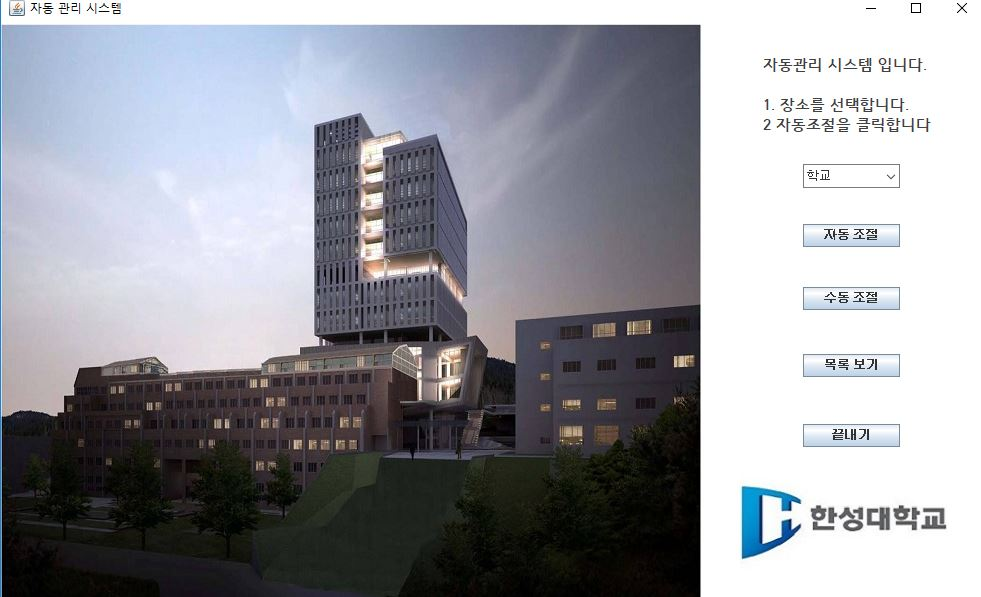
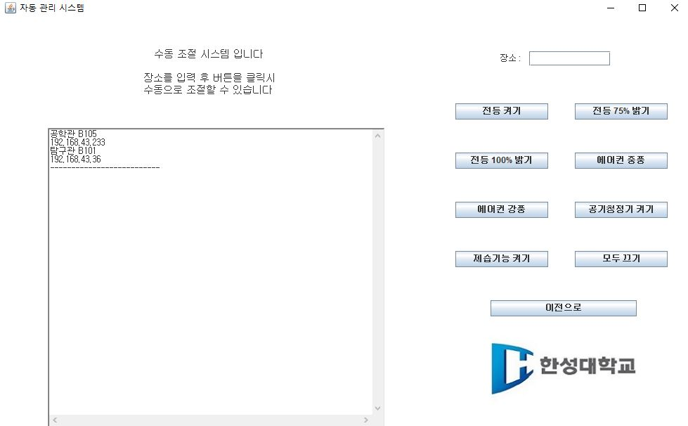
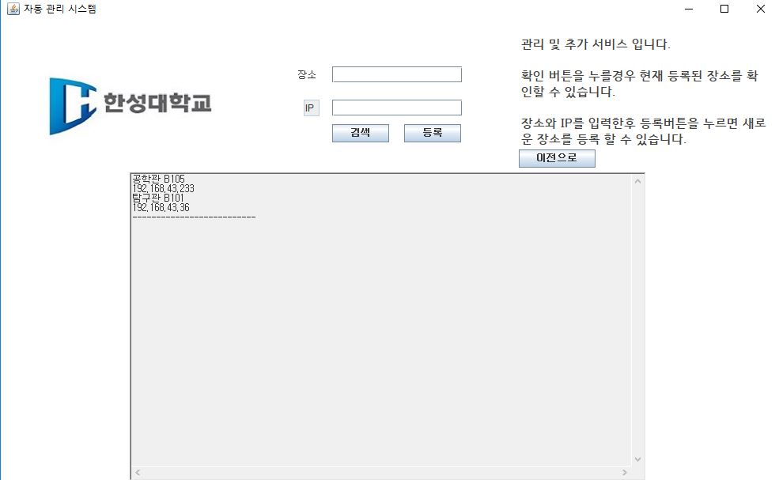
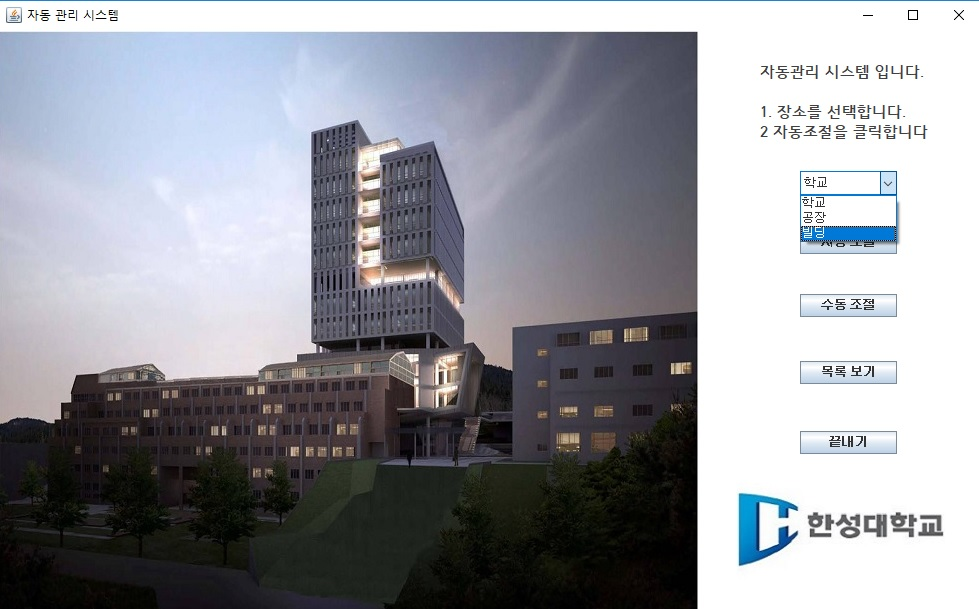

# AutomanageSystem(C.E.O) 2018.08.30 Hansung University High-Success-Project 대상
## 아두이노를 활용한 강의실 자동 관리 시스템

### 1) automanage = 자바로 만든 자동관리 프로그램

1. 자동조절
프로그램의 자동관리를 누를시 매시간 50분마다 클라우드에 올려진 데이터 값을 확인하여 난방기의 작동여부, LED의 On/Off등 제어를 아두이노에게 명령한다.

2. 수동조절
강의실의 이름을 입력하고 원하는 작동을 선택하면 그 강의실에 비치된 CEO가 작동한다.

3. 목록보기
현재 DB에 저장된 강의실을 확인할 수 있고 강의실을 등록할 수 있다.

4. 장소선택
학교뿐만 아니라 환경기준이다른 공장, 빌딩등을 선택할 수 있다.

### 2) CEO = 아두이노를 활용한 온습도, 미세먼지측정값을 Thingspeak에 저장
